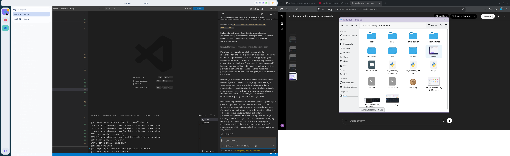
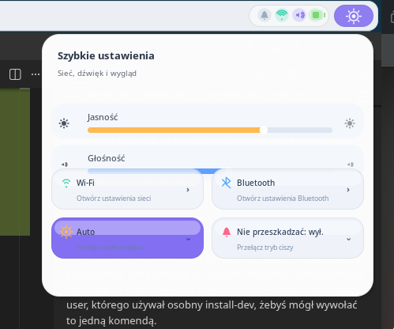

# KartONDE

KartONDE combines the Tektura Wayland compositor with the Karton shell, session services and settings application.

Language sections:
- [Polski](#polski)
- [English](#english)
- [Deutsch](#deutsch)

## Polski

KartONDE łączy kompozytor Wayland Tektura z panelem Karton, usługami sesji i aplikacją ustawień.

### Podgląd





### Zawartość repozytorium

- `tektura` - kompozytor Wayland
- `karton-shell` - górny panel, panel boczny i popupy
- `karton-session` - usługi sesyjne, screenshoty, integracja autostartu
- `karton-settings` - aplikacja ustawień
- `repo` - pomocnicze skrypty build/install dla dystrybucji
- `docs/images` - obrazy używane w dokumentacji

### Wymagania

- `meson`
- `ninja`
- kompilator C (`gcc` albo `clang`)
- podstawowe zależności Wayland i GTK4 wymagane przez podprojekty

Na Arch, Debian, Ubuntu lub openSUSE możesz też skorzystać ze skryptów w katalogu `repo`.

### Instalacja użytkownika

Z katalogu głównego projektu:

```bash
./install.sh
```

Instalator w trybie użytkownika:
- buduje `tektura`, `karton-shell`, `karton-session` i `karton-settings`
- instaluje pliki do `~/.local-karton`
- tworzy lub uzupełnia `~/.config/karton/autostart`
- restartuje komponenty sesji przez `karton-sessiond`

### Instalacja systemowa

```bash
./install.sh --system
```

Tryb systemowy instaluje pliki do `/usr/local` i używa `sudo` podczas `meson install`.

### Wersja developerska

Jeśli chcesz uruchamiać sesję na binarce developerskiej z `karton-shell/builddir-user`:

```bash
./install.sh --dev-shell
```

To polecenie:
- instaluje aktualne komponenty do `~/.local-karton`
- podmienia `~/.local-karton/bin/karton-shell` na link do `karton-shell/builddir-user/karton-shell`
- restartuje sesję tak, aby używała aktualnego builda developerskiego

Dla zgodności możesz też użyć:

```bash
./install-dev.sh
```

### Tylko build bez instalacji

```bash
./install.sh build
```

### Dodatkowe skrypty dla dystrybucji

W katalogu `repo` są gotowe skrypty dla wybranych systemów:

- `repo/build-arch.sh`
- `repo/build-debian.sh`
- `repo/build-ubuntu.sh`
- `repo/build-opensuse.sh`

### Struktura dokumentacji

Obrazy używane przez README znajdują się tutaj:

```text
docs/
  images/
    desktop-overview.png
    quick-settings.png
    workspace-overview.png
```

## English

KartONDE combines the Tektura Wayland compositor with the Karton shell, session services and settings application.

### Preview


### Repository layout

- `tektura` - Wayland compositor
- `karton-shell` - top panel, side dock and popups
- `karton-session` - session services, screenshots and autostart integration
- `karton-settings` - settings application
- `repo` - helper build and packaging scripts
- `docs/images` - images used by the documentation

### Requirements

- `meson`
- `ninja`
- a C compiler such as `gcc` or `clang`
- Wayland and GTK4 runtime/build dependencies required by the subprojects

You can also use the distro helper scripts in `repo` for Arch, Debian, Ubuntu and openSUSE.

### User installation

From the repository root:

```bash
./install.sh
```

In user mode the installer:
- builds `tektura`, `karton-shell`, `karton-session` and `karton-settings`
- installs files into `~/.local-karton`
- creates or updates `~/.config/karton/autostart`
- restarts the session components through `karton-sessiond`

### System-wide installation

```bash
./install.sh --system
```

System mode installs into `/usr/local` and uses `sudo` for `meson install`.

### Development shell mode

If you want the running session to use the development binary from `karton-shell/builddir-user`:

```bash
./install.sh --dev-shell
```

This command:
- installs the current components into `~/.local-karton`
- points `~/.local-karton/bin/karton-shell` to `karton-shell/builddir-user/karton-shell`
- restarts the session so it runs the current development shell build

For compatibility you can also use:

```bash
./install-dev.sh
```

### Build only

```bash
./install.sh build
```

### Distribution helper scripts

The `repo` directory includes ready-made scripts for selected distributions:

- `repo/build-arch.sh`
- `repo/build-debian.sh`
- `repo/build-ubuntu.sh`
- `repo/build-opensuse.sh`

### Documentation assets

README images live here:

```text
docs/
  images/
    desktop-overview.png
    quick-settings.png
    workspace-overview.png
```

## Deutsch

KartONDE kombiniert den Tektura-Wayland-Compositor mit der Karton-Shell, den Sitzungsdiensten und der Einstellungsanwendung.

### Vorschau


### Repository-Struktur

- `tektura` - Wayland-Compositor
- `karton-shell` - obere Leiste, Seiten-Dock und Popups
- `karton-session` - Sitzungsdienste, Screenshots und Autostart-Integration
- `karton-settings` - Einstellungsanwendung
- `repo` - Hilfsskripte für Build und Paketierung
- `docs/images` - Bilder für die Dokumentation

### Voraussetzungen

- `meson`
- `ninja`
- ein C-Compiler wie `gcc` oder `clang`
- die von den Teilprojekten benötigten Wayland- und GTK4-Abhängigkeiten

Für Arch, Debian, Ubuntu und openSUSE kannst du außerdem die Hilfsskripte im Verzeichnis `repo` verwenden.

### Benutzerinstallation

Im Wurzelverzeichnis des Repositories:

```bash
./install.sh
```

Im Benutzermodus erledigt der Installer Folgendes:
- baut `tektura`, `karton-shell`, `karton-session` und `karton-settings`
- installiert nach `~/.local-karton`
- erstellt oder aktualisiert `~/.config/karton/autostart`
- startet die Sitzungskomponenten über `karton-sessiond` neu

### Systemweite Installation

```bash
./install.sh --system
```

Der Systemmodus installiert nach `/usr/local` und verwendet `sudo` für `meson install`.

### Entwicklungsmodus für die Shell

Wenn die laufende Sitzung die Entwicklungsbinärdatei aus `karton-shell/builddir-user` verwenden soll:

```bash
./install.sh --dev-shell
```

Dieser Befehl:
- installiert die aktuellen Komponenten nach `~/.local-karton`
- verlinkt `~/.local-karton/bin/karton-shell` auf `karton-shell/builddir-user/karton-shell`
- startet die Sitzung neu, damit der aktuelle Entwicklungs-Build der Shell verwendet wird

Zur Kompatibilität kannst du auch Folgendes verwenden:

```bash
./install-dev.sh
```

### Nur bauen

```bash
./install.sh build
```

### Hilfsskripte für Distributionen

Im Verzeichnis `repo` befinden sich vorbereitete Skripte für ausgewählte Distributionen:

- `repo/build-arch.sh`
- `repo/build-debian.sh`
- `repo/build-ubuntu.sh`
- `repo/build-opensuse.sh`

### Dokumentationsbilder

Die im README verwendeten Bilder liegen hier:

```text
docs/
  images/
    desktop-overview.png
    quick-settings.png
    workspace-overview.png
```
